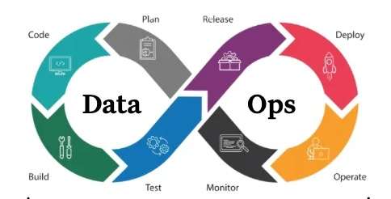

# Implementing CI/CD for your Data Engineering & Analytics Workloads
*Author: Victor Iwuoha*



_Image reference: [Monte Carlo](https://www.montecarlodata.com/blog-what-is-dataops/)_

## PREREQUISITES

### Set up environment

- if using pyenv on a Mac

```
    pyenv virtualenv <your-preferred-python-version> <you-proposed-venv-name>

    eg; 
    
    pyenv virtualenv 3.12.4 .venv-3-12-4-dataops

    pyenv activate .venv-3-12-4-dataops 
```

- If using venv on any Linux or Mac or Windows OS

```
    1) python -m venv .venv
    2) (for non-windows OS) 
            source .venv/bin/activate
    3) for Windows only
        .venv\Scripts\activate
```


## CONTINUOUS INTEGRATION


## CONTINUOUS DEPLOYMENT


## Cut the Talk !... Why Is this Important


## Getting Started with Githiub Actions for your CI/CD process

You need a .github folder with a workflows/ directory. -> `.github/workflows`
Github workflows are declared as .yaml files which are parsed and executed on github runners. In Larger orgs and enterprise accounts, you can decide to use your own self-hosted cloud runners (compute service) to execute the scripts you want to run.


- To get our fies properly formatted we would leverage the ruff library for python and the sqlfluff package for sql files.

- To validate our sql files;

        sqlfluff lint -v sql-base/

- To validate all out python files including tests;

        ruff check

    for only src files

        ruff check python_base/

Files that failed any of these tests can easily be fixed using the commandas below.
Note that while linters do not guarantee code/business logic, they drastically reduce errors related to Syntax or poor formatting. Linters also ensure that everyone on your data team who needs to contribute code to the central knowledge base complies to the team's standards. For the sqlfluff configurations we defined, see [./sqlfuff](.sqlfluff)

- To Format:

    for sql;
        
        sqlfluff fix sql-base/

    
    for python;

        ruff format -v tests python_base

    


### References

1. [Github Actions Template](https://docs.github.com/en/actions/writing-workflows/workflow-syntax-for-github-actions)

2. [Sqlfluff Docs](https://docs.sqlfluff.com/en/stable)

3. [Ruff Docs](https://docs.astral.sh/ruff/)

4. [Free Tutorial about Testing for Python Development](https://github.com/VICIWUOHA/python-tests-tutorial)
