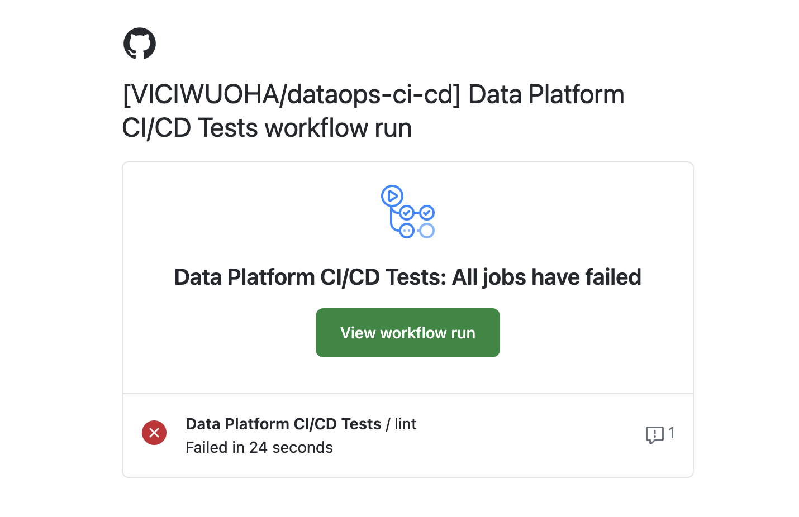
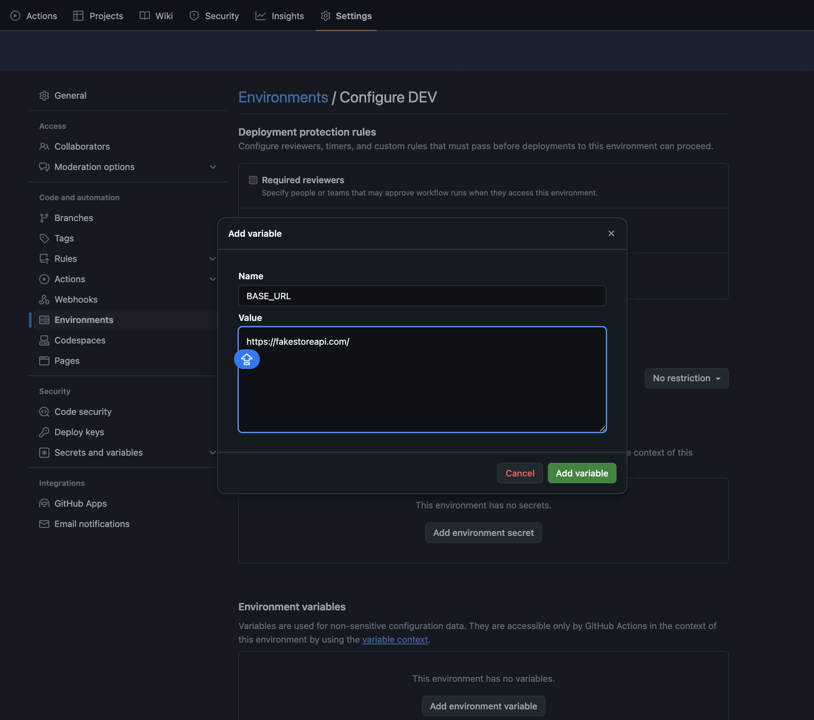

# Implementing CI/CD for your Data Engineering & Analytics Workloads
**Author: Victor Iwuoha**

*Data Platform Engineer*

_2024-10-14_


_Image reference: [Monte Carlo](https://www.montecarlodata.com/blog-what-is-dataops/)_

## PREREQUISITES


### Fork/ Clone Project Repo

- After forking/ clonin the repo to your local environment, quickly checkout to a branch named feat-ci or any other name of your choice. You can commence your changes to main from this branch.

        git checkout -b feat-ci

### Set up environment

- if using pyenv on a Mac

```
    pyenv virtualenv <your-preferred-python-version> <you-proposed-venv-name>

    eg; 
    
    pyenv virtualenv 3.12.4 .venv-3-12-4-dataops

    pyenv activate .venv-3-12-4-dataops 
```

- If using venv on any Linux or Mac or Windows OS

```
    1) python -m venv .venv
    2) (for non-windows OS) 
            source .venv/bin/activate
    3) for Windows only
        .venv\Scripts\activate
```

- Install Requirements
        pip install -r requirements.txt

- Rename `.env.example` file to `.env`


## Concept

In my interaction with data teams and professionals in Africa over the last 3 years, I discovered two things. 
1) Many Data and AI products do not make it to standard production environments in an automated and verifiable fashion.
2) Many Data teams do not implement software practices and version control for their SQL and Python workloads from Engineering to ML personnels, hence querying the quality of data products. Eg; Different numbers/outputs from the same data by the same team.


## So, What is CI/CD ?

CI/CD which stands for Continuous Integration and Continuous Delivery/Deployment is a devops process that helps software teams ship changes to products in a fast, automated/semi-automated and reliable way. This process also helps enforce policies on code assets and the way the team handles incremental code changes, new features, syntax and testing.

A typical CI/CD workflow is a cycle that invloves; Push/Publish -> Build/Test -> Deploy to test/production/ artifact registry/ some cloud storage.

## Cut the Talk !... Why Is this Important in Data Workloads

Some data teams do not use version control, but if this is in place, CI/CD makes it even more robust through the following;

- Enforcing Uniformity: We can be sure that team member A's style of writing SQL does not differ from that of team member B.

- Syntax Validation: Catching Syntax errors that could otherwise go unnoticed. In the image below, an error was caught during the ci job Ensuring things like dashboards/models dependent on the affected file(s) don't get broken. If tests fail, an alert would be triggered via email to the personnel who pushed it. See an example below;



- No Code Smells: Cleaner Code is easier to read, think of a **_ _200def _line python"file' or a 350lineSQLquery writtenbySomeone whoLEFTTHEORGa_** while ago . ...well that line was poorly formatted 😟.

## Recap
### 🔗 CONTINUOUS INTEGRATION
In this phase, new or updated code is simply validated against the main/production/master branch to ensure that no breaking changes were introduced. It may involve Linting/Syntax checks and maybe Unit tests. 

🎉 _To get a **very good understanding of Testing for Python development**, see my [Free Tutorial](https://github.com/VICIWUOHA/python-tests-tutorial).._


### 🔗 CONTINUOUS DEPLOYMENT/ DELIVERY

This "CD" aspect of the CI/CD process differs based on how changes to the central codebase are propagated to the actual production environments.

In the Continuous delivery framework, development changes are triaged after successful buiilds in a test environment/pre-merge to the production branch. A human in the loop is mostly involved in the final delivery to production. For data teams, this can simply mean a final code review after all tests pass before clicking the Merge/Deploy button. The Continuous delivery is more realistic for Data Analytics & Engineeering workloads.

Continuous deployment is a rather much more automated process that automatically releases changes to production once all the pre-defined integration tests are successfully passed. In data teams, This can be a flow where a data engineer adds a DAG to a pipeline folder, tests are triggered, PR is auto-created and/or merged to main and subsequently uploaded to a remote location eg; s3 or GCS from which a running Apache Airflow Server can automatically pick it up.


## Getting Started with Github Actions for your CI/CD Process

- Within your branch, You need a .github folder with a workflows/ sub-directory. -> `.github/workflows/`
Github workflows are declared as .yaml files which are parsed and executed on github runners. In Larger orgs and enterprise accounts, you can decide to use your own self-hosted cloud runners (compute service) to execute the validation commands/scripts in your deployment pipeline.

- For the sake of this project, Navigate to the dev branch and copy contents of the [.github/workflows/ci_main.yaml](https://github.com/VICIWUOHA/dataops-ci-cd/blob/dev/.github/workflows/ci_main.yaml) file into your own branch created earlier.

- Commit your changes and push to your branch.

        git push -u origin feat-ci

- Go to the settings/Environments section of your github repository and create an environment named `DEV`. Also create an environment variable named `BASE_URL` with the same value in your `.env` file (exclude the strings). This would be useful for running our unit tests as part of our CI/CD job.





### FORMATTING TO PASS CI/CD Runs

- After your push, navigate to the Actions Tab of your repo on github, you should notice some red checks showing failuress of your Jobs.

- To get our files properly formatted to pass the ci tests we would leverage the `ruff` library for python and the `sqlfluff` package for sql files See docs in the [References](https://github.com/VICIWUOHA/dataops-ci-cd?tab=readme-ov-file#references) section.

- To validate our sql files;

        sqlfluff lint -v sql-base/

- To validate all out python files including tests;

        ruff check

    for only core python files in our repo

        ruff check python_base/

Files that failed any of these tests can easily be fixed using the commands below.
Note that while linters drastically reduce errors related to Syntax or poor formatting, they do not guarantee code/business logic. However, Linters also ensure that everyone on your data team who needs to contribute code to the central knowledge base complies to the team's standards. For the sqlfluff configurations we defined, see [./sqlfuff](.sqlfluff)

- To Format:

    for sql;
        
        sqlfluff fix sql-base/

    
    for python;

        ruff format -v tests python_base


- Push to your branch again to validate that your CI/CD setup works.

### What Next Can be Done?

- From the [dev branch](https://github.com/VICIWUOHA/dataops-ci-cd/blob/dev/.github/workflows/ci_main_v2.yaml) Copy the `ci_main_v2.yaml` job into your repo and test to see that it runs. This workflow has 2 jobs as opposed to `ci_main.yaml` which had a single Job.

- Automate pull requests for your team when code is pushed to a specific branch.

- Deploy your pushed scripts to a remote registry, For this, you may need to configure secrets on github to allow access into eg; your docker registry or storage bucket/ cloud resource.


### Over And Out 🚀
_I hope this sparks some magic in your data team as i have experienced in the last 4 years of implementing CI/CD._

Want to discuss even more ? 🤝  _Let's connect on [Linkedin.](https://linkedin.com/in/viciwuoha)_


### References

1. [Github Actions Template](https://docs.github.com/en/actions/writing-workflows/workflow-syntax-for-github-actions)

2. [Sqlfluff Docs](https://docs.sqlfluff.com/en/stable)

3. [Ruff Docs](https://docs.astral.sh/ruff/)

4. [Free Tutorial about Testing for Python Development 🚀](https://github.com/VICIWUOHA/python-tests-tutorial)

5. [Redhat: What is CI/CD](https://www.redhat.com/en/topics/devops/what-is-ci-cd)

6. [FreeCodeCamp: How to setup a CI/CD pipeline..](https://www.freecodecamp.org/news/how-to-setup-a-ci-cd-pipeline-with-github-actions-and-aws/)

6. [Atlassian: Continuous integration vs. delivery vs. deployment](https://www.atlassian.com/continuous-delivery/principles/continuous-integration-vs-delivery-vs-deployment)

